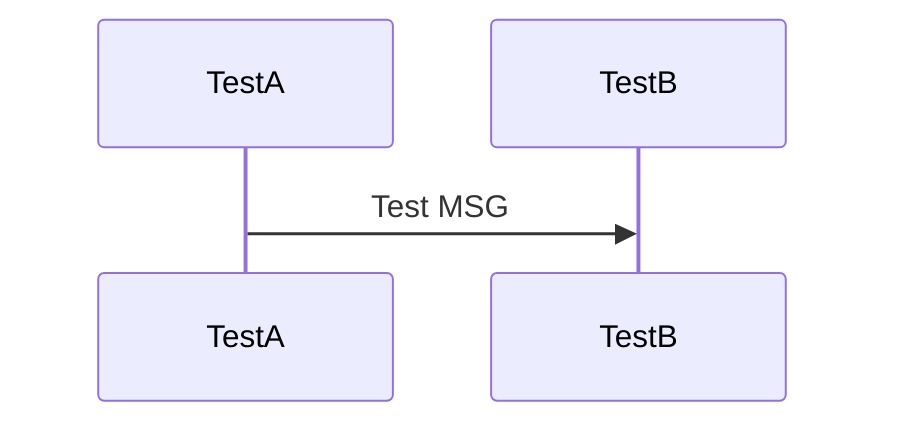

# Auction house

This is a simple auction house simulator where clients can sell and buy their imaginary commodities.

## Client interface

A user can connect through a telnet client to the auction house simulator server. In order to interact with the server, a client can type the following commands:

- `HELP` - lists the available commands.
- `LOGIN <username>` - logs in the user by its `<username>`. Only one user with the same `<username>` can be logged in at a time. Creates a new account if it doesn't exist.
- `LOGOUT` - logs out the user.
- `DEPOSIT FUNDS <amount>` - deposits `<amount>` of funds in user's account. Works only if logged in.
- `DEPOSIT ITEM <item>` - deposits an `<item>` in user's account. Works only if logged in.
- `WITHDRAWS FUNDS <amount>` - withdraws `<amount>` of funds in user's account. Works only if logged in.
- `WITHDRAWS FUNDS <item>` - withdraws an `<item>` in user's account. Works only if logged in.
- `SELL <item> <starting-price> [<expiration-time>]` - puts an `<item>` into an auction with the `<starting-price>`. The optional argument `[<expiration-time>]` is seconds from putting the `<item>` into sale, default value is `300` (5 minutes). Works only if logged in.
- `BID <item> <new-price>` - bids the `<item>` with the `<new-price>`. A user can't bid its own `<item>`. Works only if logged in.
- `SHOW FUNDS` - shows user's funds. Works only if logged in.
- `SHOW ITEMS` - shows user's items. Works only if logged in.
- `SHOW SALES` - shows sales. Works only if logged in.

The commands are case-insensitive, but the `<arguments>` are case-sensitive.

### Limitations and requirements

- Putting an item into an auction charges the seller a fee equals to `1.0` which is deduced from the final price paid by the buyer. If there is no enough funds and an item won't be sold, then a debit occurs.
- When a user bids an item, the bid amount is deducted automatically from user's funds. If a user is outbid, funds come back to its account.
- User can't bind if it doesn't have enough funds.
- User can store more than one item with the same name.
- User can sell, deposit or withdraw only one item of the same name at a time.

## Server design

The high-level overview how the server application is implemented.

There are following threads:
1. Session processor - handles new client connections, reads commands and queue them, pops queued command results and writes them to users.
2. Command processor - pops queued commands, interprets and executes them and queues results. Pushes command result to the egress queue, adds items to the auction list. 
3. Auction processor - process auction events, monitors if an auction has been expired and queues notifications to users about an item being sold, bought or outbid.

There are following queues:
1. Ingress queues - for each user connection there is a queue with data (commands) received from a user. The session processor pushes the received commands to the queue, the command processor pops them.  
2. Egress queues - for each user connection there is a queue with data (command results, auction notifications) to be sent to user. The commands processor and the auction processor puts results on this queue, the connection processor pops them. 

There are following data structures:
1. Auctions list - list of items put to an auction. Items are put here in the result of user's command and removed when an auction comes to an end.
2. User accounts map - username is the key and the value is user account which keeps info about funds and list of items. A user account can be modified by either by user or the auction processor.
3. Session id to user map - keeps entries for logged-in users to map session ids to usernames.

